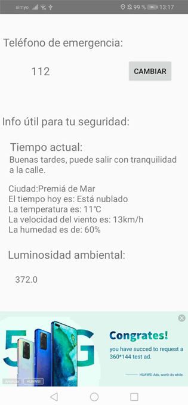

# HSD Program Spain 2020 de HUAWEI

Participación al HSD Program Spain 2020 de HUAWEI.

Página web del evento: https://developer.huawei.com/consumer/en/activity/digixActivity/digixdetail/201603786075567814

## Aplicación creada:

Para la participación en el concurso he creado una aplicación llamada FeelSafe para principalmente advertir a los usuarios al entrar en el radio de influencia de zonas peligrosas de la ciudad de Barcelona mediante tu ubicación con el uso de los kits de Huawei Mobile Services (HMS). 

Los kits de HUAWEI utilizados han sido el **Account Kit**, el **Maps Kit**, el **Ads kit**, el **Awareness Kit** y el **Site kit**.

Funcionalidades de la aplicación:

1. Login para entrar en la aplicación mediante cuenta ya creada (test@gmail.com - test) o con el Account Kit en caso de tener cuenta de Huawei.

2. Mostrar zonas peligrosas de Barcelona mediante el Maps Kit usando la figura Circle (esto en caso de mejorarlo, se debería usar Polygons para especificar mejor las zonas).

3. Anuncios tanto en la pantalla de login y en la de settings (para testear un poco con el Ads Kit)

4. Buscar en la pantalla de Search algún sitio que quieres ir evitando las zonas peligrosas para luego en el mapa mostrar como llegar desde tu posición como si fuese el Google Maps. (esto no está implementado como debería por la dificultad que hay detrás y el poco tiempo que había para crear la aplicación; se ha puesto una línea recta)

5. Botón de SOS para llamar en caso de emergencia (robo, secuestro, agresión, etc) que se puede cambiar desde la pantalla de settings introduciendo el tlf que más te interese. Por defecto, está puesto el 112.

6. Info útil para tu seguridad en la pantalla settings obtenida usando el Awareness Kit; como ejemplo tiempo, viento, luminosidad...parámetros que pueden servir para mejorar tu seguridad. (ha servido para testear con el Awareness Kit)

7. En caso de entrar o estar en una zona peligrosa, suena y vibra (Vibrator Android) y se muestra en la aplicación un warning para advertirte de ir con cuidado debido a que se encuentra en una de las zonas peligrosas. Se ha usado las locationBarrier del Awareness Kit.

En caso de querer llevar la aplicación a la práctica, esto es solo un prototipo, se podría mejorar poniendo las zonas peligrosas (con un estudio detrás teniendo en cuenta los robos, agresiones, etc por barrio) en las ciudades más importantes de Europa.

## Para probar la aplicación: 

Se recomienda usar el Cloud Debugger ya que permite poner la location que quieras y por tanto poner una que este dentro de una zona peligrosa. El problema es que el Awareness Kit no me funciona correctamente en el Cloud Debugger, por tanto la funcionalidad de mostrar un warning si estas dentro de una zona y la info útil no funcionan por desgracia.

¡CUIDADO, en un móvil Huawei no funciona tampoco si no se dan permisos de ubicación en la aplicación HMS!

Ejemplos para probar la aplicación: (locations en la ciudad de Barcelona)
- Ejemplo location **dentro** de zona peligrosa: 
    Longitud: 2.1682149000000663,
    Latitud: 41.3798432
   
- Ejemplo de location **fuera** de zona peligrosa:
    Longitud: 1.9270983540201814,
    Latitud: 41.30769110499487
    
Otro método para probar que es el que he estado usando con un teléfono Huawei prestado, es introducir una zona peligrosa justo donde te encuentras. Se puede hacer en la **línea 251** de MapsActivity. 

## Capturas de la aplicación: 

